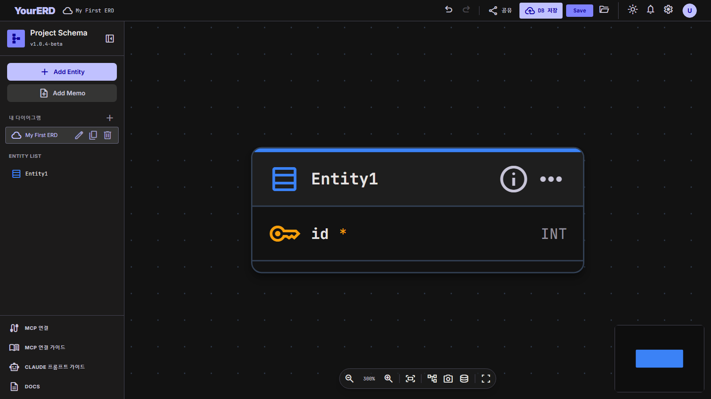

# EasyERD (erd-service)

온라인 ERD(Entity-Relationship Diagram) 작성 서비스.
브라우저에서 엔티티·관계를 시각적으로 편집하고, 로그인하면 다이어그램을 사용자별로 DB에 저장할 수 있다.



## 기술 스택

| 영역 | 기술 | 비고 |
|------|------|------|
| 프론트엔드 | React 19 + TypeScript + Vite 8 | SPA, 라우터 미사용 |
| 캔버스 | @xyflow/react (React Flow 12) | 노드/엣지 렌더링, 커스텀 노드·엣지 |
| 상태 관리 | zustand 5 | 스토어 4개로 관심사 분리 (아래) |
| 스타일 | Tailwind CSS 4 | M3 다크 팔레트 토큰 (`index.css` @theme) |
| 자동 정렬 | @dagrejs/dagre | 관계 구조 기반 레이아웃 |
| PNG 내보내기 | html-to-image | |
| 백엔드 | Fastify 5 (Node 22, ESM) | 단일 프로세스가 정적 파일 + API 모두 서빙 |
| DB | PostgreSQL (`pg`) | ORM 없음. `DATABASE_URL` 미설정 시 pg-mem 인메모리 폴백(개발/QA) |
| 인증 | JWT(@fastify/jwt) httpOnly 쿠키 + node:crypto scrypt 해싱 | 외부 의존성 최소화 |
| e2e 테스트 | Playwright | `verify_*.mjs` 스크립트 |

## 시스템 구조

```
브라우저 SPA (React) ──/api/*──> Fastify (server/index.js, :8080) ──> PostgreSQL
                      └─정적──> dist/ (빌드 결과물, SPA fallback)
```

- **단일 Node 프로세스**: 정적 서빙과 API가 같은 오리진 → CORS/프록시 불필요 (dev는 vite proxy `/api` → :8080)
- **비로그인 사용 가능**: 에디터 전체 기능을 익명으로 사용. 로그인하면 DB 저장 기능이 추가 활성화
- **SPA fallback**: 알 수 없는 경로는 index.html 반환, 단 `/api/*`는 404 JSON

### 디렉토리 구조

```
erd-service/
├── server/                  # 백엔드 (Fastify)
│   ├── index.js             # 부트스트랩: env→DB→인증→라우트→정적 서빙
│   ├── db.js                # pg Pool 또는 pg-mem 폴백, 스키마 자동 생성(idempotent DDL)
│   ├── auth-routes.js       # /api/auth — 가입/로그인/로그아웃/세션확인, scrypt 해싱
│   └── diagram-routes.js    # /api/diagrams — CRUD, JWT 필수 + 소유권 검증
├── src/
│   ├── api/client.ts        # fetch 래퍼 (비2xx → ApiError throw)
│   ├── store/
│   │   ├── erdStore.ts      # 다이어그램 문서 상태 (엔티티/관계/위치) + Undo/Redo 히스토리
│   │   ├── authStore.ts     # 로그인 상태, 세션 복원(GET /me)
│   │   ├── diagramStore.ts  # DB 다이어그램 목록/현재 ID/dirty 추적 (erdStore subscribe)
│   │   └── dialogStore.ts   # 공용 alert/confirm/prompt 모달 (Promise 기반)
│   ├── components/
│   │   ├── toolbar/Toolbar.tsx        # GNB: Undo/Redo·DB 저장·JSON Save/Load·로그인 아바타
│   │   ├── sidebar/Sidebar.tsx        # 내 다이어그램 목록(로그인 시) + Entity List
│   │   ├── canvas/ERDCanvas.tsx       # React Flow 캔버스 + 줌 툴바(정렬/PNG)
│   │   ├── nodes/EntityNode.tsx       # 엔티티 노드 (PK 섹션 / 일반 컬럼 섹션 분리)
│   │   ├── edges/RelationshipEdge.tsx # Barker 표기 관계선 + 연결점 분산 + 선택 툴바
│   │   ├── panels/EntityEditPanel.tsx # 우측 Properties — 컬럼 편집·드래그 순서 변경
│   │   ├── panels/RelTypeModal.tsx    # 관계 종류 선택/변경 모달
│   │   ├── auth/AuthModal.tsx         # 로그인/가입 모달
│   │   └── common/DialogModal.tsx     # 공용 다이얼로그 렌더러
│   ├── utils/
│   │   ├── erdData.ts       # ERDData(저장 포맷) ↔ 스토어 상태 변환
│   │   ├── fileIO.ts        # JSON 파일 저장/불러오기
│   │   ├── autoLayout.ts    # dagre 자동 정렬
│   │   ├── exportImage.ts   # PNG 내보내기
│   │   └── edgeConnection.ts# 관계선 연결점 분산 계산
│   └── types/erd.ts         # Entity/Column/Relationship/ERDData 타입
└── verify_*.mjs             # Playwright e2e (아래 QA 체계)
```

## 데이터 모델

```ts
Entity       { id, name(물리명), logicalName?(논리명), description?, color, columns: Column[] }
Column       { id, name, logicalName?, type, size, isPK, isFK, isNN, isUnique, refEntityId?, refColumnId? }
Relationship { id, sourceId(상위), targetId(하위), type }
ERDData      { version: "1.0", entities: { entity, position }[], relationships }  // 저장 포맷
```

- `ERDData`는 JSON 파일 저장과 DB 저장(`diagrams.data` JSONB)에 동일하게 사용
- 관계 타입: `ONE_TO_MANY_IDENTIFYING` / `ONE_TO_MANY_NON_IDENTIFYING` / `ONE_TO_MANY_OPTIONAL` / `ONE_TO_ONE_IDENTIFYING` / `ONE_TO_ONE_NON_IDENTIFYING`

### FK 자동 생성 규칙

관계 연결 시 상위 엔티티의 PK가 하위 엔티티에 FK 컬럼으로 자동 생성된다 (`{상위명소문자}_{pk명}`, 논리명 자동 조합).

| 관계 타입 | FK 생성 | PK(식별자) 포함 | NOT NULL |
|---|:---:|:---:|:---:|
| 식별 (1:M, 1:1) | O | O | O |
| 비식별 (1:M, 1:1) | O | X | O |
| 선택 (1:M) | O | X | X (NULL 허용) |

- 관계 **타입 변경** 시 FK 플래그만 전환 (PK 승격/해제 — 사용자가 수정한 컬럼명 보존)
- 관계/상위 엔티티 **삭제** 시 자동 생성된 FK도 함께 제거 (`refEntityId` 기준), Undo로 복원 가능

### 편집 기능

- 엔티티/컬럼 CRUD, 컬럼 드래그 순서 변경, 노드 드래그 배치, 색상
- 관계선 드래그 연결(Barker 표기, 연결점 분산), 타입 변경, 삭제
- Undo/Redo (Ctrl+Z/Y, 연속 입력 800ms 병합, 상한 50)
- dagre 자동 정렬, PNG 내보내기, JSON 파일 저장/불러오기 (비로그인 포함)
- 파괴적 동작(삭제/미저장 이탈)은 공용 확인 모달 사용

## API 명세

공통: JSON, 인증은 httpOnly 쿠키 `token`(JWT, 7일). 실패 시 `401 {error:"Unauthorized"}`.

| Method | Path | Body | 성공 | 에러 |
|---|---|---|---|---|
| POST | `/api/auth/register` | `{username, password}` | `201 {id, username}` + 쿠키 | `400` 형식, `409 username_taken` |
| POST | `/api/auth/login` | `{username, password}` | `200 {id, username}` + 쿠키 | `401 invalid_credentials` |
| POST | `/api/auth/logout` | — | `200 {ok}` | — |
| GET | `/api/auth/me` | — | `200 {id, username}` | `401` |
| GET | `/api/diagrams` | — | `200 [{id, name, updated_at}]` (data 제외) | `401` |
| POST | `/api/diagrams` | `{name, data}` | `201 {id, name, updated_at}` | `400`, `401` |
| GET | `/api/diagrams/:id` | — | `200 {id, name, data, updated_at}` | `401`, `404` |
| PUT | `/api/diagrams/:id` | `{name?, data}` | `200` (name은 전달 시만 변경) | `400`, `401`, `404` |
| PATCH | `/api/diagrams/:id` | `{name}` | `200` 이름 변경 | `400`, `401`, `404` |
| DELETE | `/api/diagrams/:id` | — | `200 {ok}` | `401`, `404` |

- username: 3~50자, `[a-zA-Z0-9_.-]` / password: 8자 이상
- 모든 다이어그램 접근은 `user_id` 소유권 검증 (타인 것은 404)

## DB 스키마

서버 첫 기동 시 자동 생성 (`CREATE TABLE IF NOT EXISTS`, 마이그레이션 도구 없음).

```sql
users    (id SERIAL PK, username VARCHAR(50) UNIQUE, pw_hash VARCHAR(255), created_at)
diagrams (id SERIAL PK, user_id INT FK→users ON DELETE CASCADE,
          name VARCHAR(120), data JSONB, created_at, updated_at)
-- INDEX idx_diagrams_user ON diagrams(user_id)
```

## 환경변수 (.env — git 제외, `.env.example` 참고)

| 변수 | 설명 |
|------|------|
| `DATABASE_URL` | `postgresql://user:pw@localhost:5432/erd_service` — **미설정 시 pg-mem 인메모리로 동작 (재시작 시 데이터 소실, 개발/QA 전용)** |
| `JWT_SECRET` | 토큰 서명 키 (`openssl rand -hex 32` 권장). 미설정 시 dev 기본값 + 경고 |
| `PORT` / `HOST` | 기본 8080 / 0.0.0.0 |

## 실행

```bash
# 개발 (터미널 2개)
npm run dev          # Vite :5173 (API는 :8080으로 프록시)
npm start            # Fastify :8080

# 프로덕션
npm ci && npm run build && npm start
```

### 배포 (Ubuntu + pm2)

```bash
cd /tough/app/harness-test/erd-service
git pull
PLAYWRIGHT_SKIP_BROWSER_DOWNLOAD=1 npm ci   # 의존성 변경 시
npm run build
pm2 restart erd --update-env                # 최초: pm2 start server/index.js --name erd && pm2 save
pm2 logs erd --lines 20                     # "PostgreSQL 연결" 로그 확인
```

## QA 체계 (Playwright e2e)

서버 기동 후 `node verify_<이름>.mjs` 실행. `BASE_URL` env 지원 (기본은 스크립트별 5174 또는 8080).
코드 변경 시 영향권 스크립트 재실행이 관례 (루트 CLAUDE.md의 유지보수 QA 절차 참고).

| 스크립트 | 검증 대상 |
|---|---|
| verify_server | 프로덕션 서버 — 정적 서빙·SPA fallback·/api 404 |
| verify_backend | 가입→DB저장→세션복원→열기·모달·401/409 (24항목) |
| verify_features | Undo/Redo·관계 타입 변경·자동 정렬·PNG (14항목) |
| verify_fk_cleanup | 엔티티/관계 삭제 시 FK 정리, 비식별 FK (13항목) |
| verify_column_drag | 컬럼 드래그 순서 변경 (5항목) |
| verify_logical | 논리명/물리명 병기·FK 논리명 자동 조합 |
| verify_design | EasyERD 레이아웃·관계·FK |
| verify_sidebar_cleanup / verify_gnb_cleanup | 사이드바·GNB 정리 회귀 |
| verify_erd / verify_barker / verify_fanout | (구버전 — 디자인 개편 이전 UI 기준, 동작 불가) |

변경 이력은 루트 `CLAUDE.md`의 변경 이력 테이블에 기록한다.
